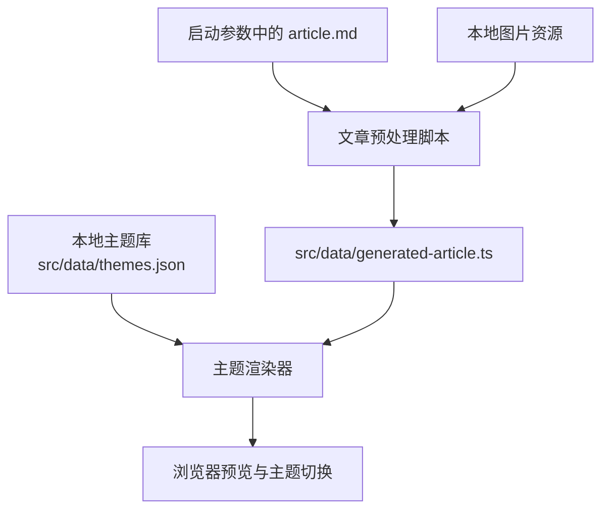

# 主题离线预览

本项目用本地主题库和一份固定 Markdown 预览多个主题的 HTML 效果。另一个程序只要按约定写入 Markdown 文件，本工程就可以切换主题预览并复制公众号富文本。



## 启动

```bash
npm install
npm run dev
```

默认地址：`http://127.0.0.1:5173/`

## Markdown 输入

推荐在启动或构建时传入 Markdown 文件路径：

```bash
npm run dev -- /absolute/path/to/article.md
npm run build -- /absolute/path/to/article.md
```

也可以用环境变量指定：

```bash
ARTICLE_MD=/absolute/path/to/article.md npm run dev
ARTICLE_MD=/absolute/path/to/article.md npm run build
```

不传路径时，默认读取 `content/article.md`；如果该文件也不存在，会生成一篇占位文章并打印 `console.warn`。

`npm run dev` 和 `npm run build` 会先执行文章预处理，把 Markdown 预处理成 `src/data/generated-article.ts`，前端只读取这个生成文件。

开发模式会监听传入的 Markdown 文件。文件保存后会自动重新预处理，并通过 Vite 刷新页面：

```bash
npm run dev -- /absolute/path/to/article.md
```

构建模式不会监听文件，只处理一次。

## 本地图片规则

Markdown 里的本地图片会在预处理阶段转成 base64 data URL，预览和复制使用同一份内容。

支持两种写法：

```markdown


```

路径解析规则：

- 相对路径：相对当前 Markdown 文件所在目录解析，例如 `./images/a.png`。
- 绝对本地路径：直接读取本机文件，例如 `/Users/me/article/images/a.png`。
- 以 `/` 开头的路径：优先从 `public` 目录解析，例如 `/uploads/a.png` 对应 `public/uploads/a.png`。
- `http(s)://`、`data:`、`blob:` 图片不会被处理，会原样保留。
- 找不到本地图片时会 `console.warn`，并保留原图片路径，不会静默丢图。

## 验证

```bash
npm test
npm run build
npm audit
```

## 样式编辑

右侧面板支持按截图中的分组实时修改当前预览：

- `文本`：标题、正文、引用、分割线，以及加粗文本样式。
- `图片`：图片宽度、圆角、阴影、说明文字和图片间距。
- `背景`：文章容器背景色、内边距和外边距。
- `装饰`：按主题装饰组件编辑可识别的颜色变量。
- `底板`：预览区域背景底纹，支持网格、圆点、交叉等样式。

修改会保存在浏览器 `localStorage`，右上角 `重置样式` 可清空所有自定义样式并回到主题原始效果。
